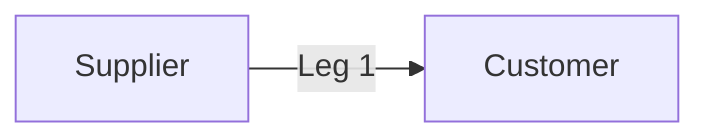
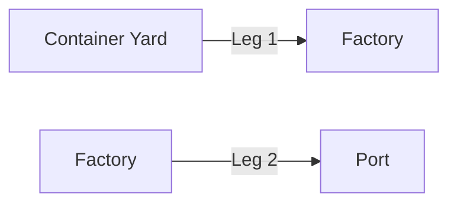
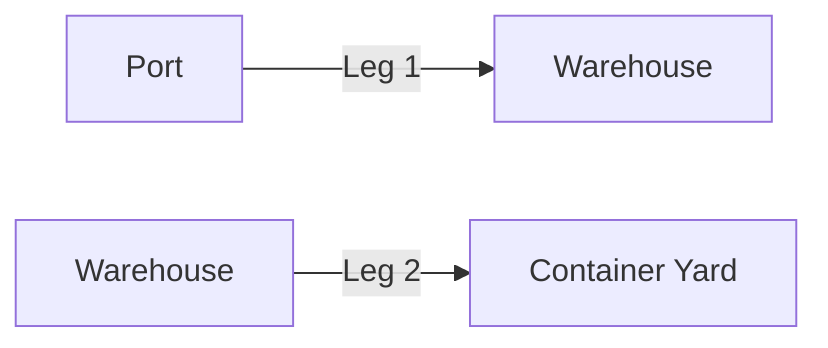
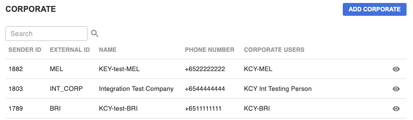

# Anatomy of An Order Request
## How to structure the JSON payload to create an order

This document will detail the fields and nested fields required in the JSON payload to create an `Order`.

<!-- theme: success -->

> 💡 For a quick background on the terminology used in this document, check out [Yojee Terminology](./yojee-terminology.md)

## Single-Leg vs Multi-Leg Orders
In the most simple case, an `Order` will have a single leg, like the following example. A Supplier wants to ship his items to a Customer. In this case, there will be one `Leg` and there will be a `Pickup Task` at the Supplier and a `Dropoff Task` at the Customer.



However, in some cases, an `Order` can have more than one leg. Examples of multi-leg `Orders`  include moving containers between factories and the port for export and imports

**Export**
- **Leg 1** Pickup empty container from Container Yard and send to Factory/Warehouse for loading
- **Leg 2** Pickup filled container from Factory/Warehouse and send to Port


**Import**
- **Leg 1** Pickup container from Port and send to Warehouse/Customer location
- **Leg 2** Pickup empty container from Warehouse/Customer and return to Container Yard


---

## Create a Single-Leg Order
To create a Single-Leg `Order` via the Yojee API, we make a call to
[**Create Order**](https://yojee.stoplight.io/docs/yojee-api/publish/yojee-order-api.yaml/paths/~1api~1v3~1dispatcher~1orders/post) with a JSON payload that adheres to the following schema.


```json json_schema
title: 'Create Single-Leg Order Request'
required:
  - items
  - steps
  - item_steps
type: object
properties:
  external_id:
    type: string
    description: For entering any tracking number from partner system
  sender_id:
    type: integer
    description: Sender ID.  Takes precedence over `external_sender_id`
  external_sender_id:
    type: string
    description: External Sender ID
  sender_type:
    type: string
    description: Sender Type. For most integration this is `organisation`
    enum:
      - organisation
      - individual
  placed_by_user_profile_id:
    type: string
    description: User profile ID of user that placed the order
  price_currency:
    type: string
    description: Order currency
  price_amount:
    type: number
    description: Order price
  container_no:
    type: string
    description: Used when order is tied to a container
  items:
    type: array
    description: List of items to be sent
    items:
      type: object
      properties:
        description:
          type: string
        width:
          type: number
        length:
          type: number
        height:
          type: number
        weight:
          type: number
        quantity:
          type: number
        info:
          type: string
        external_customer_id:
          type: string
          description: For storing external reference
        external_customer_id2:
          type: string
          description: For storing external reference
        external_customer_id3:
          type: string
          description: For storing external reference
        payload_type:
          type: string
          description: Item Type defined in Yojee Dispatcher
        price_info:
          type: string
        service_type:
          type: string
          description: Service Type defined in Yojee Dispatcher
        service_type_id:
          type: integer
          description: Service Type ID of the Service Type for this order. Not needed if `service_type` is provided
        volume:
          type: number
        volumetric_weight:
          type: number
        price_amount:
          type: number
      required:
        - payload_type
        - service_type
  steps:
    type: array
    description: List of delivery details for pick up and drop off steps
    items:
      type: object
      properties:
        address:
          type: string
        address2:
          type: string
        country:
          type: string
        state:
          type: string
        postal_code:
          type: string
        contact_company:
          type: string
        contact_name:
          type: string
        contact_phone:
          type: number
          description: The phone number if SMS notification is required. The corresponding notification setting also needs to be enabled in Yojee Dispatcher
        contact_email:
          type: string
          description: The email address if email notification is required. The corresponding notification setting also needs to be enabled in Yojee Dispatcher
        from_time:
          type: string
          description: Start of time slot for this step in ISO8601 format
        to_time:
          type: string
          description: End of time slot for this step in ISO8601 format
        lat:
          type: number
          description: If lat/lng for the location is not provided, Yojee will attempt to geocode using the address
        lng:
          type: number
          description: If lat/lng for the location is not provided, Yojee will attempt to geocode using the address
      required:
        - address
        - country
        - from_time
        - to_time
  item_steps:
    type: array
    description: List of item steps
    items:
      type: object
      properties:
        item_id:
          type: number
        order_step_id:
          type: number
        step_group:
          type: number
        step_sequence:
          type: number
        type:
          type: string
          description: This can be `pickup` or `dropoff`
      required:
        - item_id
        - order_step_id
        - type
```

### First Level parameters
Parameters to provide more information in the `Orders`. These parameters are all non-mandatory:
- **external_id** Every `Order` will be assigned a Yojee `Order Number`(sometimes referred to as `Order ID`) that looks like `O-4W4TUNATPG9S`. To identify the order using your own order id, enter the value of your order id in this field.
- **price_currency**
- **price_amount**
- **container_no** Used to track the container no for this order. 
- **Parameters for Sender** see next section

#### Parameters for Sender


The following parameters relate to telling Yojee who is the `Sender` for this order. These parameters are all non-mandatory:
- **sender_id** After creating a `Sender` in the `Dispatcher Portal` (see above screenshot), you will see a numeric Sender ID in the table listing the `Senders`. Use this numeric ID to indicate that the `Order` is sent by this `Sender`. When both this field and the **external_sender_id** fields are present in the payload, this field takes precedence.
- **external_sender_id** When creating a `Sender` in the `Dispatcher Portal`, there is an option to assign an External ID to the `Sender`. Use this External ID in this field to indicate that the `Order` is sent by this `Sender`. 
- **sender_type** Either `organisation` or `individual`. Use `organisation` for integration purposes.
- **placed_by_user_profile_id** This field indicates the `User` in Yojee system that created this order.

### Nested parameters
The Create Order payload includes the following nested parameters that are **required**:
- **items** information for the `Items` in the `Order`
- **steps** information on location and time requirements for the respective `Task`
- **item_steps** linking the `Items` to the `Steps`

#### Items
An array of `Items` in the `Order` that needs to be moved.

#### Steps
An array of `Steps` that contains
- **address information** Address-related fields to indicate where this `Step` needs to take place. There are also the `lat` and `lng` fields to allow you to input the exact geo-coordinates of the location.
- **contact information** Contact information of the person at the location. Email address and phone information may be used for notifications through SMS or Email.
- **time slots** `from_time` and `to_time` to indicate the time slot within which the `Task` at this `Step` needs to be completed.

#### Item Steps
An array of JSON objects linking up the `Items` and `Steps` defined above.

Each `Item` will be implicitly assigned an `item_id`, starting with 0 for the first item and incrementing by 1.

Each `Step` will also be implicityly assigned an `order_step_id`, starting with 0 for the first step and incrementing by 1.

The values in `ItemStep` will then link them up with a JSON like the following:
```json
    {
      "item_id": 0,
      "order_step_id": 0,
      "type": "pickup"
    },
    {
      "item_id": 0,
      "order_step_id": 1,
      "type": "dropoff"
    }
```

This means, the first `Item` has a `Pickup Task` at the location indicated at the first `Step`, and there is also a `Dropoff Task` at the location indicated at the second `Step`.

<!-- theme: warning -->
> Note that for more than one `Item`, there will need to be more than one pair of `ItemSteps` defined.

### Sample Payload

```json
 {
  "item_steps": [
    {
      "item_id": 0,
      "order_step_id": 0,
      "type": "pickup"
    },
    {
      "item_id": 0,
      "order_step_id": 1,
      "type": "dropoff"
    },
    {
      "item_id": 1,
      "order_step_id": 0,
      "type": "pickup"
    },
    {
      "item_id": 1,
      "order_step_id": 1,
      "type": "dropoff"
    }

  ],
  "steps": [
    {
      "address": "20 Pasir Pajang Road",
      "address2": "",
      "country": "SG",
      "state": "",
      "postal_code": "117439",
      "contact_company": "S Company",
      "contact_name": "John Lim",
      "contact_phone": 62010000,
      "contact_email": "john@company1.example.com",
      "from_time": "2021-08-01T08:59:22.813Z",
      "to_time": "2021-08-02T07:59:59.813Z"
    },
    {
      "address": "1 Changi Business Park",
      "address2": "Avenue 1",
      "country": "SG",
      "state": "",
      "postal_code": "486058",
      "contact_company": "C Company",
      "contact_name": "Peter Tan",
      "contact_phone": 62010001,
      "contact_email": "peter@company2.example.com",
      "from_time": "2021-08-03T08:59:22.813Z",
      "to_time": "2021-08-04T07:59:59.813Z"
    }
  ],
  "items": [
    {
      "description": "Laptop Computer",
      "width": 0.11,
      "length": 0.12,
      "height": 0.044,
      "weight": 334,
      "quantity": 4,
      "info": "Item information",
      "external_customer_id": "TN-001",
      "external_customer_id2": "CUSTOMER-INFO-001",
      "external_customer_id3": "",
      "payload_type": "same_day",
      "price_info": "",
      "service_type": "express",
      "volume": 1000,
      "volumetric_weight": 1,
      "price_amount": 100
    },
    {
      "description": "Printer",
      "width": 0.11,
      "length": 0.12,
      "height": 0.044,
      "weight": 334,
      "quantity": 1,
      "info": "Item information",
      "external_customer_id": "TN-001",
      "external_customer_id2": "CUSTOMER-INFO-001",
      "external_customer_id3": "",
      "payload_type": "same_day",
      "price_info": "",
      "service_type": "express",
      "volume": 1000,
      "volumetric_weight": 1,
      "price_amount": 100
    }
  ]
}
```

The payload above has two `Items` - 4 Laptop computers and 1 Printer to be picked up at 20 Pasir Panjang Road and dropped off at 1 Changi Business Park. Note that there are 4 `ItemSteps`.

<!-- ---

## Create a Multi-Leg Order
To create a Multi-Leg `Order` via the Yojee API, we make a call to
[**Create Order**](https://yojee.stoplight.io/docs/yojee-api/publish/yojee-order-api.yaml/paths/~1api~1v3~1dispatcher~1orders-multi-leg/post) with a JSON payload that adheres to the following schema.

```json json_schema
title: 'Create Multi-Leg Order Request'
required:
  - items
  - steps
  - item_steps
type: object
properties:
  external_id:
    type: string
    description: For entering any tracking number from partner system
  sender_id:
    type: integer
    description: Sender ID. Takes precedence over `external_sender_id`
  external_sender_id:
    type: string
    description: External Sender ID.
  sender_type:
    type: string
    description: Sender Type. For most integration this is `organisation`
    enum:
      - organisation
      - individual
  placed_by_user_profile_id:
    type: string
    description: Only in cases where there are Corporate Users created under Corporate Sender
  price_currency:
    type: string
    description: Order currency
  price_amount:
    type: number
    description: Order price
  container_no:
    type: string
    description: Used when order is tied to a container
  items:
    type: array
    description: List of items to be sent
    items:
      type: object
      properties:
        description:
          type: string
        width:
          type: number
        length:
          type: number
        height:
          type: number
        weight:
          type: number
        quantity:
          type: number
        info:
          type: string
        external_customer_id:
          type: string
          description: For storing external reference
        external_customer_id2:
          type: string
          description: For storing external reference
        external_customer_id3:
          type: string
          description: For storing external reference
        payload_type:
          type: string
          description: Item Type defined in Yojee Dispatcher
        price_info:
          type: string
        service_type:
          type: string
          description: Service Type defined in Yojee Dispatcher
        service_type_id:
          type: integer
          description: Service Type ID of the Service Type for this order. Not needed if `service_type` is provided
        volume:
          type: number
        volumetric_weight:
          type: number
        price_amount:
          type: number
      required:
        - payload_type
        - service_type
  steps:
    type: array
    description: List of delivery details for pick up and drop off steps
    items:
      type: object
      properties:
        address:
          type: string
        address2:
          type: string
        country:
          type: string
        state:
          type: string
        postal_code:
          type: string
        contact_company:
          type: string
        contact_name:
          type: string
        contact_phone:
          type: number
          description: The phone number if SMS notification is required. The corresponding notification setting also needs to be enabled in Yojee Dispatcher
        contact_email:
          type: string
          description: The email address if email notification is required. The corresponding notification setting also needs to be enabled in Yojee Dispatcher
        from_time:
          type: string
          description: Start of time slot for this step in ISO8601 format
        to_time:
          type: string
          description: End of time slot for this step in ISO8601 format
        lat:
          type: number
          description: If lat/lng for the location is not provided, Yojee will attempt to geocode using the address
        lng:
          type: number
          description: If lat/lng for the location is not provided, Yojee will attempt to geocode using the address
      required:
        - address
        - country
        - from_time
        - to_time
  item_steps:
    type: array
    description: List of item steps
    items:
      type: object
      properties:
        item_id:
          type: number
        order_step_id:
          type: number
        step_group:
          type: number
        step_sequence:
          type: number
        type:
          type: string
          description: This can be `pickup` or `dropoff`
      required:
        - item_id
        - order_step_id
        - step_group
        - step_sequence
        - type
```
 -->


