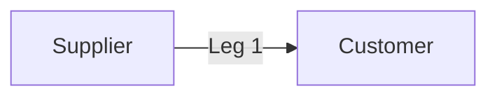
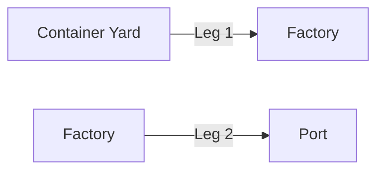
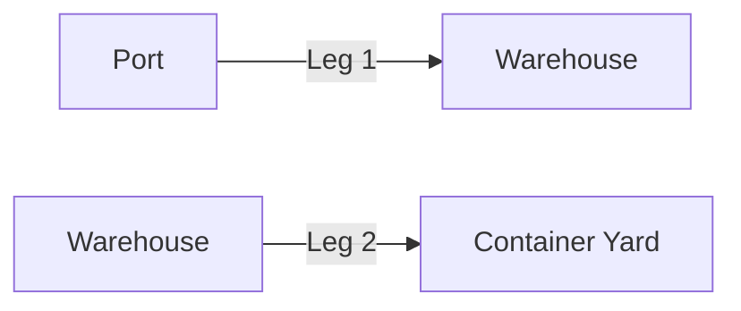

# Anatomy of An Order Request
## How to structure the JSON payload to create an order

This document will detail the fields and nested fields required in the JSON payload to create an `Order`.

<!-- theme: success -->

> 💡 For a quick background on the terminology used in this document, check out [Yojee Terminology](./yojee-terminology.md)

## Single-Leg vs Multi-Leg Orders
In the most simple case, an `Order` will have a single leg, like the following example. A Supplier wants to ship his items to a Customer. In this case, there will be one `Leg` and there will be a `Pickup Task` at the Supplier and a `Dropoff Task` at the Customer.



However, in some cases, an `Order` can have more than one leg. Examples of multi-leg `Orders`  include moving containers between factories and the port for export and imports

**Export**
- **Leg 1** Pickup empty container from Container Yard and send to Factory/Warehouse for loading
- **Leg 2** Pickup filled container from Factory/Warehouse and send to Port


**Import**
- **Leg 1** Pickup container from Port and send to Warehouse/Customer location
- **Leg 2** Pickup empty container from Warehouse/Customer and return to Container Yard


---

## Create a Single-Leg Order
To create a Single-Leg `Order` via the Yojee API, we make a call to
[**Create Order**](https://yojee.stoplight.io/docs/yojee-api/publish/yojee-order-api.yaml/paths/~1api~1v3~1dispatcher~1orders/post) with a JSON payload that adheres to the following schema.


```json json_schema
title: 'Create Single-Leg Order Request'
required:
  - items
  - steps
  - item_steps
type: object
properties:
  external_id:
    type: string
    description: For entering any tracking number from partner system
  sender_id:
    type: integer
    description: Sender ID.  Takes precedence over `external_sender_id`
  external_sender_id:
    type: string
    description: External Sender ID
  sender_type:
    type: string
    description: Sender Type. For most integration this is `organisation`
    enum:
      - organisation
      - individual
  placed_by_user_profile_id:
    type: string
    description: User profile ID of user that placed the order
  price_currency:
    type: string
    description: Order currency
  price_amount:
    type: number
    description: Order price
  container_no:
    type: string
    description: Used when order is tied to a container
  items:
    type: array
    description: List of items to be sent
    items:
      type: object
      properties:
        description:
          type: string
        width:
          type: number
        length:
          type: number
        height:
          type: number
        weight:
          type: number
        quantity:
          type: number
        info:
          type: string
        external_customer_id:
          type: string
          description: For storing external reference
        external_customer_id2:
          type: string
          description: For storing external reference
        external_customer_id3:
          type: string
          description: For storing external reference
        payload_type:
          type: string
          description: Item Type defined in Yojee Dispatcher
        price_info:
          type: string
        service_type:
          type: string
          description: Service Type defined in Yojee Dispatcher
        service_type_id:
          type: integer
          description: Service Type ID of the Service Type for this order. Not needed if `service_type` is provided
        volume:
          type: number
        volumetric_weight:
          type: number
        price_amount:
          type: number
      required:
        - payload_type
        - service_type
  steps:
    type: array
    description: List of delivery details for pick up and drop off steps
    items:
      type: object
      properties:
        quantity:
          type: number
        address:
          type: string
        address2:
          type: string
        country:
          type: string
        state:
          type: string
        postal_code:
          type: string
        contact_company:
          type: string
        contact_name:
          type: string
        contact_phone:
          type: number
          description: The phone number if SMS notification is required. The corresponding notification setting also needs to be enabled in Yojee Dispatcher
        contact_email:
          type: string
          description: The email address if email notification is required. The corresponding notification setting also needs to be enabled in Yojee Dispatcher
        from_time:
          type: string
          description: Start of time slot for this step in ISO8601 format
        to_time:
          type: string
          description: End of time slot for this step in ISO8601 format
        lat:
          type: number
          description: If lat/lng for the location is not provided, Yojee will attempt to geocode using the address
        lng:
          type: number
          description: If lat/lng for the location is not provided, Yojee will attempt to geocode using the address
      required:
        - address
        - country
        - from_time
        - to_time
  item_steps:
    type: array
    description: List of item steps
    items:
      type: object
      properties:
        item_id:
          type: number
        order_step_id:
          type: number
        step_group:
          type: number
        step_sequence:
          type: number
        type:
          type: string
          description: This can be `pickup` or `dropoff`
      required:
        - item_id
        - order_step_id
        - type
```

### First Level parameters
#### External Id
Every `Order` will be assigned a Yojee `Order Number`(sometimes referred to as `Order ID`) that looks like `O-4W4TUNATPG9S`. To identify the order using your own order id, enter the value of your order id in this field.

#### Parameters for Sender


The following parameters relate to telling Yojee who is the `Sender` for this order:
- **sender_id** After creating a `Sender` in the `Dispatcher Portal`, you will see a numeric Sender ID in the table listing the `Senders`. Use this numeric ID to indicate that the `Order` is sent by this `Sender`. When both this field and the **external_sender_id** fields are present in the payload, this field takes precedence.
- **external_sender_id** When creating a `Sender` in the `Dispatcher Portal`, there is an option to assign an External ID to the `Sender`. Use this External ID in this field to indicate that the `Order` is sent by this `Sender`. 
- **sender_type** Either `organisation` or `individual`. Use `organisation` for integration purposes.
- **placed_by_user_profile_id** This field indicates the `User` in Yojee system that created this order. It is not a mandatory field and can be left out

### Nested parameters

---

## Create a Multi-Leg Order
To create a Multi-Leg `Order` via the Yojee API, we make a call to
[**Create Order**](https://yojee.stoplight.io/docs/yojee-api/publish/yojee-order-api.yaml/paths/~1api~1v3~1dispatcher~1orders-multi-leg/post) with a JSON payload that adheres to the following schema.

```json json_schema
title: 'Create Multi-Leg Order Request'
required:
  - items
  - steps
  - item_steps
type: object
properties:
  external_id:
    type: string
    description: For entering any tracking number from partner system
  sender_id:
    type: integer
    description: Sender ID. Takes precedence over `external_sender_id`
  external_sender_id:
    type: string
    description: External Sender ID.
  sender_type:
    type: string
    description: Sender Type. For most integration this is `organisation`
    enum:
      - organisation
      - individual
  placed_by_user_profile_id:
    type: string
    description: Only in cases where there are Corporate Users created under Corporate Sender
  price_currency:
    type: string
    description: Order currency
  price_amount:
    type: number
    description: Order price
  container_no:
    type: string
    description: Used when order is tied to a container
  items:
    type: array
    description: List of items to be sent
    items:
      type: object
      properties:
        description:
          type: string
        width:
          type: number
        length:
          type: number
        height:
          type: number
        weight:
          type: number
        quantity:
          type: number
        info:
          type: string
        external_customer_id:
          type: string
          description: For storing external reference
        external_customer_id2:
          type: string
          description: For storing external reference
        external_customer_id3:
          type: string
          description: For storing external reference
        payload_type:
          type: string
          description: Item Type defined in Yojee Dispatcher
        price_info:
          type: string
        service_type:
          type: string
          description: Service Type defined in Yojee Dispatcher
        service_type_id:
          type: integer
          description: Service Type ID of the Service Type for this order. Not needed if `service_type` is provided
        volume:
          type: number
        volumetric_weight:
          type: number
        price_amount:
          type: number
      required:
        - payload_type
        - service_type
  steps:
    type: array
    description: List of delivery details for pick up and drop off steps
    items:
      type: object
      properties:
        quantity:
          type: number
        address:
          type: string
        address2:
          type: string
        country:
          type: string
        state:
          type: string
        postal_code:
          type: string
        contact_company:
          type: string
        contact_name:
          type: string
        contact_phone:
          type: number
          description: The phone number if SMS notification is required. The corresponding notification setting also needs to be enabled in Yojee Dispatcher
        contact_email:
          type: string
          description: The email address if email notification is required. The corresponding notification setting also needs to be enabled in Yojee Dispatcher
        from_time:
          type: string
          description: Start of time slot for this step in ISO8601 format
        to_time:
          type: string
          description: End of time slot for this step in ISO8601 format
        lat:
          type: number
          description: If lat/lng for the location is not provided, Yojee will attempt to geocode using the address
        lng:
          type: number
          description: If lat/lng for the location is not provided, Yojee will attempt to geocode using the address
      required:
        - address
        - country
        - from_time
        - to_time
  item_steps:
    type: array
    description: List of item steps
    items:
      type: object
      properties:
        item_id:
          type: number
        order_step_id:
          type: number
        step_group:
          type: number
        step_sequence:
          type: number
        type:
          type: string
          description: This can be `pickup` or `dropoff`
      required:
        - item_id
        - order_step_id
        - step_group
        - step_sequence
        - type
```


