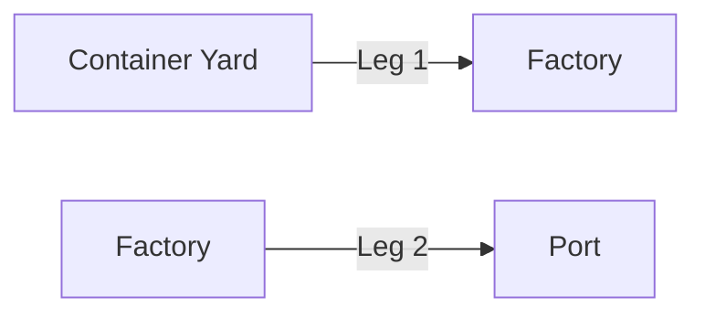
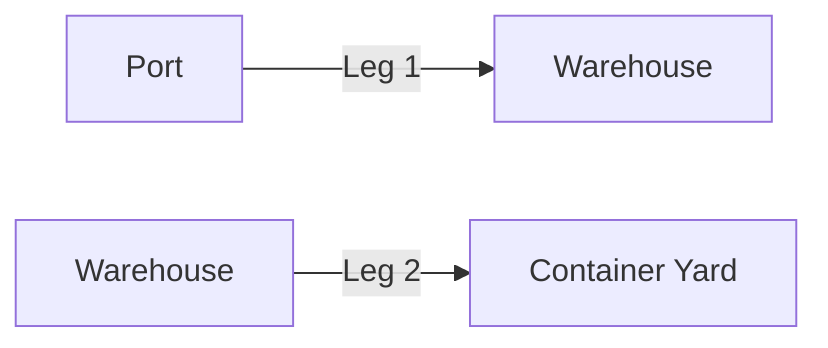

# Anatomy of An Order Request

## How to structure the JSON payload to create an order

This document will detail the fields and nested fields required in the JSON payload to create an `Order`.

<!-- theme: success -->

> 💡 For a quick background on the terminology used in this document, check out [Yojee Terminology](./yojee-terminology.md)

## Single-Leg vs Multi-Leg Orders

In the most simple case, an `Order` will have a single leg, like the following example. A Supplier wants to ship his items to a Customer. In this case, there will be one `Leg` and there will be a `Pickup Task` at the Supplier and a `Dropoff Task` at the Customer.


However, in some cases, an `Order` can have more than one leg. Examples of multi-leg `Orders` include moving containers between factories and the port for export and imports

**Export**

- **Leg 1** Pickup empty container from Container Yard and send to Factory/Warehouse for loading
- **Leg 2** Pickup filled container from Factory/Warehouse and send to Port



**Import**

- **Leg 1** Pickup container from Port and send to Warehouse/Customer location
- **Leg 2** Pickup empty container from Warehouse/Customer and return to Container Yard



---

## Create a Single-Leg Order

To create a Single-Leg `Order` via the Yojee API, we make a call to
[**Create Order**](https://yojee.stoplight.io/docs/yojee-api/publish/yojee-order-api.yaml/paths/~1api~1v4~1company~1orders~1create/post) with a JSON payload that adheres to the following schema.

```json json_schema
title: Create Single-Leg Order Request
type: object
properties:
  order_info:
    type: object
    required:
      - sender
      - service_type_name
      - template_type_id
    properties:
      external_id:
        description: Order External ID
        type: string
      sender:
        type: object
        properties:
          external_id:
            description: Sender External ID
            type: string
      service_type_name:
        description: Service Type Name
        type: string
      template_type_id:
        description: Template Type ID
        type: integer
  order_items:
    type: array
    items:
      type: object
      required:
        - payload_type
      properties:
        description:
          description: Description
          type: string
        external_customer_id:
          description: External Customer ID
          type: string
        external_customer_id2:
          description: External Customer ID 2
          type: string
        external_customer_id3:
          description: External Customer ID 3
          type: string
        height:
          description: Height
          type: number
        height_unit:
          description: Height Unit
          enum:
            - millimeter
            - centimeter
            - meter
            - inch
            - foot
            - yard
          type: string
        info:
          description: Additional Info
          type: string
        item_container:
          type: object
          properties:
            container_no:
              description: Container Number
              type: string
            description:
              description: Description
              type: string
            iso_type:
              description: ISO Type
              type: string
            seal_no:
              description: Seal Number
              type: string
            slot_date:
              description: Slot Date
              format: date-time
              type: string
            slot_reference:
              description: Slot Reference
              type: string
            weight:
              description: Weight
              type: number
            vgm:
              description: VGM
              type: number
            vgm_unit:
              description: VGM Unit
              type: string
            vgm_date:
              description: VGM Date
              format: date-time
              type: string
            vgm_party:
              description: VGM Party
              type: string
        length:
          description: Length
          type: number
        length_unit:
          description: Length Unit
          enum:
            - millimeter
            - centimeter
            - meter
            - inch
            - foot
            - yard
          type: string
        payload_type:
          description: Payload Type
          type: string
        quantity:
          description: Quantity
          type: integer
        volume:
          description: Volume
          type: number
        volume_unit:
          description: Volume Unit
          enum:
            - cubic_centimeter
            - cubic_meter
            - cubic_inch
            - cubic_foot
          type: string
        volumetric_weight:
          description: Volumetric Weight
          type: number
        volumetric_weight_unit:
          description: Volumetric Weight Unit
          enum:
            - kilogram
            - pound
          type: string
        weight:
          description: Weight
          type: number
        weight_unit:
          description: Weight Unit
          enum:
            - gram
            - kilogram
            - metric_ton
            - ounce
            - pound
            - ton
          type: string
        width:
          description: Width
          type: number
        width_unit:
          description: Width Unit
          enum:
            - millimeter
            - centimeter
            - meter
            - inch
            - foot
            - yard
          type: string
  order_steps:
    type: array
    items:
      type: object
      required:
        - address
        - from_time
        - to_time
      properties:
        address:
          description: Street Address
          type: string
        address2:
          description: Building / Apartment / Unit Info
          type: string
        city:
          description: City
          type: string
        contact_company:
          description: Contact company name
          type: string
        contact_email:
          description: Contact email address
          type: string
        contact_name:
          description: Contact person name
          type: string
        contact_phone:
          description: Contact phone number
          type: string
        country:
          description: Country
          type: string
        from_time:
          description: Update timestamp
          format: date-time
          type: string
        postal_code:
          description: Postal Code
          type: string
        state:
          description: State
          type: string
        timezone:
          description: Timezone
          type: string
        to_time:
          description: Update timestamp
          format: date-time
          type: string
  order_item_steps:
    type: array
    items:
      type: object
      required:
        - order_step_group_index
        - order_step_index
        - order_item_index
        - type
        - step_sequence
      properties:
        order_item_index:
          description: OrderItem index
          type: integer
        order_step_group_index:
          description: OrderStepGroup index
          type: integer
        order_step_index:
          description: OrderStep index
          type: integer
        step_sequence:
          description: Step sequence number
          type: integer
        type:
          description: Task Type
          type: string
required:
  - order_info
  - order_items
  - order_steps
  - order_item_steps
```

### First Level parameters

Parameters to provide more information in the `Orders`. These parameters are all non-mandatory:

- **external_id** Every `Order` will be assigned a Yojee `Order Number`(sometimes referred to as `Order ID`) that looks like `O-4W4TUNATPG9S`. To identify the order using your own order id, enter the value of your order id in this field.
- **Parameters for Sender** see next section

#### Parameters for Sender


The following parameters relate to telling Yojee who is the `Sender` for this order.

- **sender_id** After creating a `Sender` in the `Dispatcher Portal` (see above screenshot), you will see a numeric Sender ID in the table listing the `Senders`.
- **external_id** When creating a `Sender` in the `Dispatcher Portal`, there is an option to assign an External ID to the `Sender`. Use this External ID in this field to indicate that the `Order` is sent by this `Sender`.

### Required Parameters

The Create Order payload includes the following nested parameters that are **required**:

- **order_items** information for the `Items` in the `Order`
- **order_steps** information on location and time requirements for the respective `Task`
- **order_item_steps** linking the `Items` to the `Steps`

#### Order Items

An array of `Items` in the `Order` that needs to be moved.

#### Order Steps

An array of `Steps` that contains

- **address information** Address-related fields to indicate where this `Step` needs to take place. There are also the `lat` and `lng` fields to allow you to input the exact geo-coordinates of the location.
- **contact information** Contact information of the person at the location. Email address and phone information may be used for notifications through SMS or Email.
- **time slots** `from_time` and `to_time` to indicate the time slot within which the `Task` at this `Step` needs to be completed.

#### Order Item Steps

An array of JSON objects linking up the `Order Items` and `Order Steps` defined above.

Each `Item` will be implicitly assigned an `order_item_index`, starting with 0 for the first item and incrementing by 1.

Each `Step` will also be implicitly assigned an `order_step_index`, starting with 0 for the first step and incrementing by 1.

The values in `order_item_steps` will then link them up with a JSON like the following:

```json
    {
      "order_item_index": 0,
      "order_step_index": 0,
      "type": "pickup",
      "step_sequence": 0,
      "order_step_group_index": 0
    },
    {
      "order_item_index": 0,
      "order_step_index": 1,
      "type": "dropoff",
      "step_sequence": 1,
      "order_step_group_index": 0
    }
```

This means, the first `Item` has a `Pickup Task` at the location indicated at the first `Step`, and there is also a `Dropoff Task` at the location indicated at the second `Step`.

<!-- theme: warning -->

> Note that for more than one `Item`, there will need to be more than one pair of `order_item_steps` defined.

### Sample Payload

```json
{
  "order_item_steps": [
    {
      "order_item_index": 0,
      "order_step_index": 0,
      "type": "pickup",
      "step_sequence": 0,
      "order_step_group_index": 0
    },
    {
      "order_item_index": 0,
      "order_step_index": 1,
      "type": "dropoff",
      "step_sequence": 1,
      "order_step_group_index": 0
    },
    {
      "order_item_index": 1,
      "order_step_index": 0,
      "type": "pickup",
      "step_sequence": 0,
      "order_step_group_index": 0
    },
    {
      "order_item_index": 1,
      "order_step_index": 1,
      "type": "dropoff",
      "step_sequence": 1,
      "order_step_group_index": 0
    }
  ],
  "order_steps": [
    {
      "address": "20 Pasir Pajang Road",
      "address2": "",
      "country": "SG",
      "state": "",
      "postal_code": "117439",
      "contact_company": "S Company",
      "contact_name": "John Lim",
      "contact_phone": 62010000,
      "contact_email": "john@company1.example.com",
      "from_time": "2021-08-01T08:59:22.813Z",
      "to_time": "2021-08-02T07:59:59.813Z"
    },
    {
      "address": "1 Changi Business Park",
      "address2": "Avenue 1",
      "country": "SG",
      "state": "",
      "postal_code": "486058",
      "contact_company": "C Company",
      "contact_name": "Peter Tan",
      "contact_phone": 62010001,
      "contact_email": "peter@company2.example.com",
      "from_time": "2021-08-03T08:59:22.813Z",
      "to_time": "2021-08-04T07:59:59.813Z"
    }
  ],
  "order_items": [
    {
      "description": "Laptop Computer",
      "width": 0.11,
      "length": 0.12,
      "height": 0.044,
      "weight": 334,
      "quantity": 4,
      "info": "Item information",
      "external_customer_id": "TN-001",
      "external_customer_id2": "CUSTOMER-INFO-001",
      "external_customer_id3": "",
      "payload_type": "package",
      "volume": 1000,
      "volumetric_weight": 1
    },
    {
      "description": "Printer",
      "width": 0.11,
      "length": 0.12,
      "height": 0.044,
      "weight": 334,
      "quantity": 1,
      "info": "Item information",
      "external_customer_id": "TN-001",
      "external_customer_id2": "CUSTOMER-INFO-001",
      "external_customer_id3": "",
      "payload_type": "box",
      "volume": 1000,
      "volumetric_weight": 1
    }
  ]
}
```

The payload above has two `Order Items` - 4 Laptop computers and 1 Printer to be picked up at 20 Pasir Panjang Road and dropped off at 1 Changi Business Park. Note that there are 4 `order_item_steps`.
