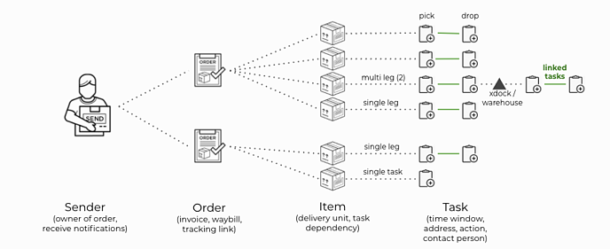

# Yojee Terminology
## What does an order do? What is an Item?

## Sender
There is an individual or a company who is requesting for the service. In Yojee, this person is called a `Sender`. This `Sender` represents the owner of the order, and receives relevant notifications so that he/she is kept updated on the status of its progress.

## Order
A `Sender` can place multiple `Orders`. An `Order` represents a "request for service" and can contain one or more `Items`. A single `Order` is attached to a single invoice, a single waybill, and a single tracking page.

## Item
An `Item` represents a delivery unit e.g. package, pallet, container. Yojee allows dispatchers to view, manage and dispatch items on an individual basis or in bulk.

Because an `Item` is often a physical object, the `Tasks` under a single `Item` requires time dependency. If an `Item` has two `Tasks`, then Task 1 has to be completed before Task 2 can be started. This dependency helps to enforces the chain of accountability through the delivery process. 

## Task
Each `Task` has a specified address location and time window in which the `Task` can be executed. For example, a `Task` could be to perform a drop off at the Empire State Building from 1000hr to 1500hr. Optionally the `Task` can also specify the contact person and contact information. Depending on how your business operates, each Item can be completed with a single task, two tasks, or more complex series of linked and unlinked tasks. 

A common setup for courier delivery for example, will require each item to have two `Tasks` (a pickup `Task` and a drop off `Task`). Because it is important that both of these tasks are executed by the same driver, the tasks are created as linked. Linked `Tasks` specifies a requirement that all tasks linked together has to be executed by a single `Driver`.

Another example involving a cross dock is where a delivery requires four tasks (pickup - drop off - pickup - drop off). In this case, the driver of the first leg does not have to be the same driver as the second leg. Therefore a suitable linking configuration would have the first two tasks linked, and the last two tasks linked.
