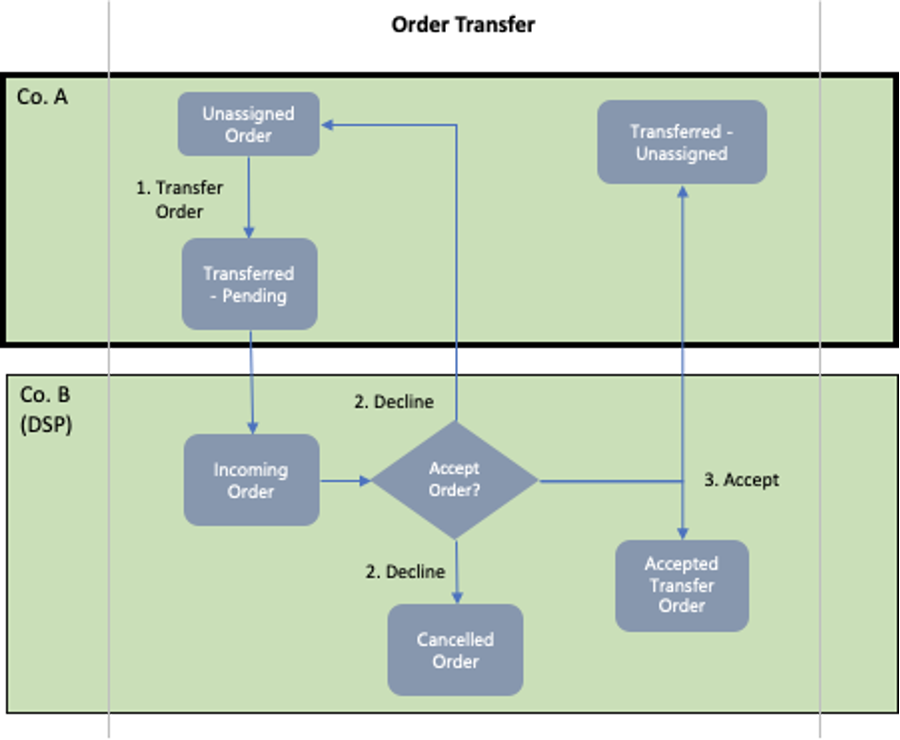
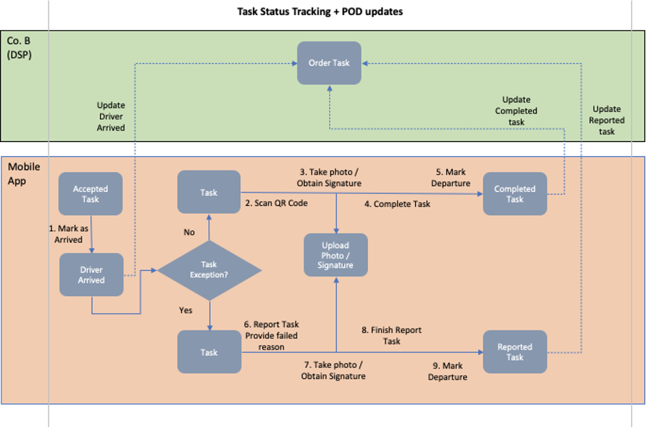
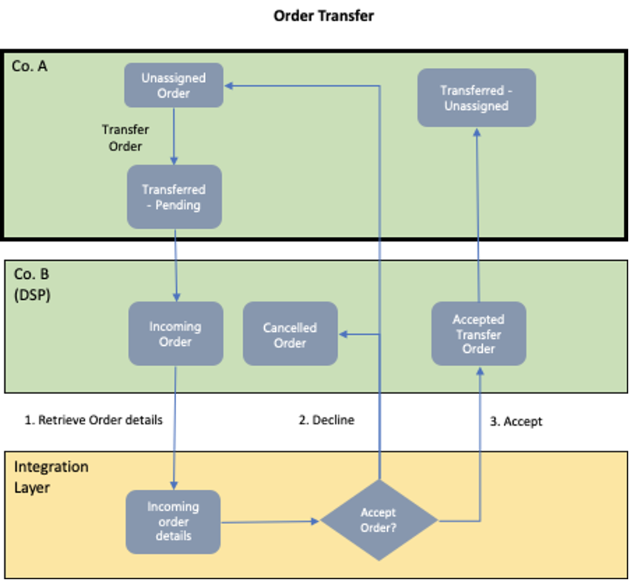
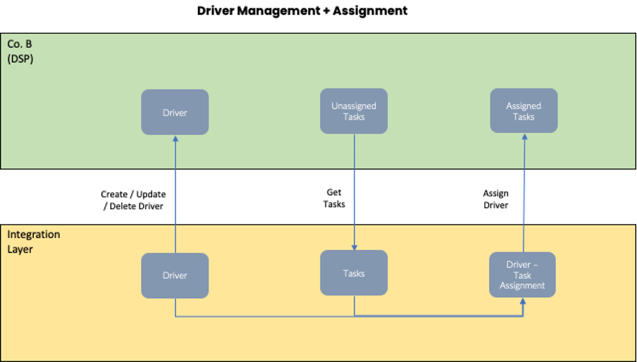

**Downstream Partner Integration Solution Guide**

## Overview

Yojee’s customers use our platform to track their transport orders. In some use cases, they transfer orders to their downstream partners (DSPs for abbreviation) for further order execution. This is achieved through creating a separate instance in Yojee (we refer to this as a ‘slug’) and providing the DSP to access this slug. The DSP will proceed to assign drivers to the transferred orders and their drivers will do status updates. The status updates will be visible in both the DSP and the upstream partner (USP), Yojee customer’s slugs.

**Section 1** in this document will outline the current operations for the above flow in further detail.

In certain cases, the DSPs have their own Transport Management Systems, and would like to integrate with Yojee. To achieve this, there is a need to call specific Yojee APIs.

**Section 2** in this document will first outline the integration flow, and describe the individual API calls needed. It is also important to understand the flow in Section 1 to be able to understand how the integration flow will work.

## Current Operations

The diagram below outlines the main components of current transfer order operations.

The components are:

- Order Transfer
  - where the order transfer is initiated by the USP to the DSP and DSP decides whether to accept the transfer
- Task Status Tracking + POD updates
  - where the external TMS will mark the various stages of pickup/dropoff task completions, and upload signatures or pictures of the delivery as PODs

In the diagram above:

- **Company A** has access to the Dispatcher Portal for its own slug (green background with thick borders).
- **Company B** (downstream partner) has access to the Dispatcher for its own slug (green background).
- **External TMS** will call TCMS api to do several actions.

## Order Transfer



### Process Description

1. When Company A has an order it wishes to transfer to its DSP Company B, the Company A Dispatcher will go to Company A’s Yojee Dispatcher portal (in short, in **Co. A’s slug**) to select the order and initiate the transfer. The order will be in the status **Transferred - Pending** in Co. A’s slug.

   Company B Dispatcher will see an incoming order with options to **Accept** or **Decline** in Company B’s Yojee Dispatcher portal (in short, in **Co. B’s slug**).

2. If Company B **declines** the transfer, the order will return as **unassigned** in Co’s A slug, and show as **Cancelled** in Co. B’s slug
3. If Company B **accepts** the transfer, the order will show as **Transferred - Unassigned** in Co. A’s slug and **Accepted** in Co. B’s slug. The order would now be transferred from Company A to Company B.

## Driver Management and Assignment

### Process Description

After the order has been transferred to Co. B, it is the responsibility of Co. B to assign the order to a Driver for the execution of the order.

For Driver Management, the Co. B Dispatcher can go to Co. B’s slug to:

1. Create/Edit/Delete Drivers. Once drivers have been created in Co. B’s slug, the orders can be assigned. External TMS might have
their own drivers. It is not necessary to create all these drivers in TCMS. If the external TMS does not want to populate the actual driver details as part of order assignment, in the api driver name can be used as `Unknown`.

But if we want to save the actual driver details as part of order, dispatcher need to create the drivers in the Co. B's slug.

For each order, there is a concept of tasks. In the most common use cases, an order will have a **pickup** task and a **dropoff** task. After the order has been transferred to Co. B, the tasks will also be visible in Co. B’s slug as **Unassigned**.

To assign the task(s) to a driver, in Co. B’s slug (If Co. B's drivers are using Yojee mobile app):

2. Assign the task(s) to a driver. The driver will see new tasks in **Incoming Assignments** on the mobile app. He can choose to Accept or Reject.
3. If the driver **rejects** the incoming assignment, the task will show as **Unassigned** again in Co. B’s slug
4. If the driver **accepts** the incoming assignment, the task will show as **Assigned** in Co. B’s slug. At the same time, the order will show as Transferred-Assigned in Co. A’s slug.

Another way to assign tasks is by calling the assign api.

## Task Status Tracking + POD updates (If using TCMS mobile app)



### Process Description

1. When the driver arrives at the location, he has to first use the mobile app to **Mark as Arrived**. A message will be sent to mark the driver’s arrival and the driver’s arrival time can be viewed in the order’s item audit log in Co. B’s slug.

After that, depending on whether there is any task exception, meaning that whether it is possible to complete the task, it will either be **Completed** or **Reported**.

2. If the task can be completed, the driver will proceed to scan the QR Code in the waybill.
3. The driver will take a photo or obtain the required signature. The rules for whether photo and/or signature are required is configurable. After the photo and/or signature are obtained, the mobile app will upload the images to the cloud.
4. Driver will confirm completion of the task, and
5. Mark departure from the location. At this point, messages will be sent to the Yojee backend to update the task as completed. In Co. B’s slug the task will show as **Completed** along with the POD link. In Co. A’s slug the task will show as **Transferred-Completed** along with the POD link.
6. If the task cannot be completed, the driver will click on the ‘report’ link and choose a Task Exception Reason Code, or enter a customer reason code.
7. The driver will take a photo or obtain the required signature. The rules for whether photo and/or signature are required is configurable. After the photo and/or signature are obtained, the mobile app will upload the images to the cloud.
8. Driver will confirm reporting of the task, and
9. Mark departure from the location. The task would then be marked as Reported. At this point, messages will be sent to the Yojee backend to update the task as reported. In Co. B’s slug the task will show as **Reported** along with the POD link. In Co. A’s slug the task will show as **Transferred-Reported** along with the POD link.

## Integration Solution

## Overview


With the understanding in Section 1 of how the Current Operations work, the solution to integrate Yojee with DSP’s TMS is designed as follows:

- Co. A will continue to use its slug in Yojee for its operations
- A slug will be created for Co. B (DSP) in Yojee. Co. A will continue to transfer orders to Co. B through Co. A’s slug.
- An **Integration Layer** will need to be introduced between Yojee’s backend and DSP’s TMS to be the bridge between both systems. The Integration Layer will communicate with Yojee using a set of standard Yojee APIs to perform the operations previously performed manually in Co. B’s slug and the drivers’ mobile app. Decision points in the Integration Layer, like whether the transfer order is accepted and whether the driver accepts the tasks, will likely be dependent on the information coming from the Co. B’s TMS.

The Integration Solution can also be broken down into the following components.

- Order Transfer
  - to retrieve incoming order details
  - to accept / decline the incoming orders
- Driver Management and Assignment
  - to assign tasks to drivers
- Task Status Tracking + POD updates
  - to send status updates to Yojee backend
  - to notify Yojee backend of uploaded photo and/or signature images.

## Order Transfer



For the API calls in this section **Order Transfer**, the Integration Layer needs to authenticate using Co. B’s Dispatcher credentials. This is typically done by including the COMPANY_SLUG and the Dispatcher’s ACCESS_TOKEN in the HTTP header.

<!-- theme: info -->

> ### Note
>
> See the section on **Basic Information on APIs - Authentication** at the end of this document for more information on authentication.

### Retrieve incoming order details

Incoming transfer orders will be in Co. B’s slug as orders with **created** status. To retrieve the order information and the order item information for these orders, we will need to make 2 calls:

- Dispatcher Get Orders with status **created**.
- Dispatcher Get Single Order Detail by retrieving the **order_number** from the call above.

### [Dispatcher Get List of Orders](https://yojee.stoplight.io/docs/yojee-downstream-api/publish/api_v4_company_orders.yaml/paths/~1api~1v4~1company~1orders/get)

This API call will retrieve orders matching the criteria provided in the parameters.

For full request/response details, please click on the title.

###### Sample Curl Command

```shell
curl --location -g --request GET '[BASEURL]/api/v4/company/orders?page_size=50&page=1&status[]=created&from=2022-11-14T16:00:00.000Z&to=2022-11-14T16:00:00.000Z' \
--header 'COMPANY_SLUG: [SLUG]' \
--header 'ACCESS_TOKEN: [TOKEN]'
```

### [Dispatcher Get Order](https://yojee.stoplight.io/docs/yojee-downstream-api/publish/api_v4_company_order.yaml/paths/~1api~1v4~1company~1order/get)

This API call will retrieve order information based on either order number or order external id.

For full request/response details, please click on the title.

###### Sample Curl Command

```shell
curl --location -g --request GET '[BASEURL]/api/v4/company/order?number=O-K02IHA1XHHWU' \
--header 'COMPANY_SLUG: [SLUG]' \
--header 'ACCESS_TOKEN: [TOKEN]'
```

### [Accept the transfer order](https://yojee.stoplight.io/docs/yojee-downstream-api/publish/api_v4_company_order_bulk_accept.yaml/paths/~1api~1v4~1company~1order~1bulk_accept/put)

#### **Dispatcher Accept Partner Transfer Order**

Call this API to **accept** the transfer order from upstream partner.

###### Sample Curl Command

```shell
curl --location --request PUT '[BASEURL]/api/v4/company/order/bulk_accept' \
--header 'COMPANY_SLUG: [SLUG]' \
--header 'ACCESS_TOKEN: [TOKEN]'
```

For full request/response details, please click on the title.

### [Decline the transfer order](https://yojee.stoplight.io/docs/yojee-downstream-api/publish/api_v3_dispatcher_partner_transfer_dispatcher_bulk_reject_order.yaml/paths/~1api~1v3~1dispatcher~1partner_transfer~1dispatcher~1bulk_reject/post)

##### **Dispatcher Reject Partner Transfer Order**

Call this API to **reject** the transfer order from upstream partner.

###### Sample Curl Command

```shell
curl --location --request POST '[BASEURL]/api/v3/dispatcher/partner_transfer/dispatcher/bulk_reject' \
--header 'COMPANY_SLUG: [SLUG]' \
--header 'ACCESS_TOKEN: [TOKEN]'
```

For full request/response details, please click on the title.

### [Creating/Updating charges](https://yojee.stoplight.io/docs/yojee-downstream-api/publish/api_v4_company_upsert_charges.yaml/paths/~1api~1v4~1company~1integration~1order~1{number}/charges/put)

Call this API to **create / update** charges linked to an order

For full request/response details, please click on the title.

###### Sample Curl Command

```shell
curl --location --request PUT '[BASEURL]/api/v4/company/integration/order/{number}/charges' \
--header 'COMPANY_SLUG: [SLUG]' \
--header 'ACCESS_TOKEN: [TOKEN]'
```

### [Get Rate Charge Types](https://yojee.stoplight.io/docs/yojee-downstream-api/publish/api_v3_dispatcher_get_rate_charge_types.yaml/paths/~1api~1v3~1dispatcher~1rates~1rate_charge_types/get)

Call this API to **get** rate charge types

For full request/response details, please click on the title.

### Driver Management and Assignment



For the API calls in this section **Driver Management and Assignment**, the Integration Layer needs to authenticate as Dispatcher to Yojee. This is typically done by including the COMPANY_SLUG and the Dispatcher’s ACCESS_TOKEN in the HTTP header.

<!-- theme: info -->

> ### Note
>
> See the section on **Basic Information on APIs - Authentication** at the end of this document for more information on authentication.

Tasks can be assigned to the `Unknown` driver.

### Assign Driver

#### Dispatcher Assign Driver to tasks

Call this API to assign a Driver to tasks.

###### Sample Curl Command

```shell
curl --location --request POST '[BASEURL]/api/v4/company/delivery_execution/assign' \
--header 'COMPANY_SLUG: [SLUG]' \
--header 'ACCESS_TOKEN: [TOKEN]' \
--header 'Content-Type: application/json' \
--data-raw '{
    "data": 
        [
            {"orders": [
                {
                    "number": "O-MXNCVU9PEFC2",
                    "step_sequences": [0]
                }
            ],
            "driver": {
                "name": "Unknown",
                "assigned_time": "2025-06-19T06:35:12.78"
            }
            }
        ]
    
}'
```

For full request/response details, please click on the title.

###### Sample Response

```json
{
  "data": [
    {
      "data": {
        "selectors": [
          {
            "number": "O-EMEM10XJADI6"
          }
        ]
      },
      "status": "success"
    }
  ]
}
```

## Task Status Tracking + POD updates


## Basic Information on APIs

### Base URL

In this document we will use [BASEURL] to represent the base URL for the calls.

For **development and testing purposes**, please use https://umbrella-staging.yojee.com.

The base URL for the **Production API** is https://umbrella.yojee.com.

### Authentication

Most of the API calls will require the following parameters in the header:

<table style="text-align: left;">
    <tr>
        <td><strong>Parameter</strong></td>
        <td><strong>Type</strong></td>
    </tr>
    <tr>
        <td>company_slug</td>
        <td>string</td>
    </tr>
    <tr>
        <td>access_token</td>
        <td>string</td>
    </tr>
</table>

##### Company Slug

The Company Slug is a string to uniquely identify each instance of a customer’s company in Yojee. Each customer is assigned a slug which they will use as part of the authentication information.

##### Access Token

A long-lived Access Token is generated for the `Dispatcher` account. This token will only change upon a change in the password of the Dispatcher account.

Obtain this information from the Yojee team working with you.

In this document we will use `[SLUG]` and `[TOKEN]` to represent the `company_slug` and `access_token` respectively.
