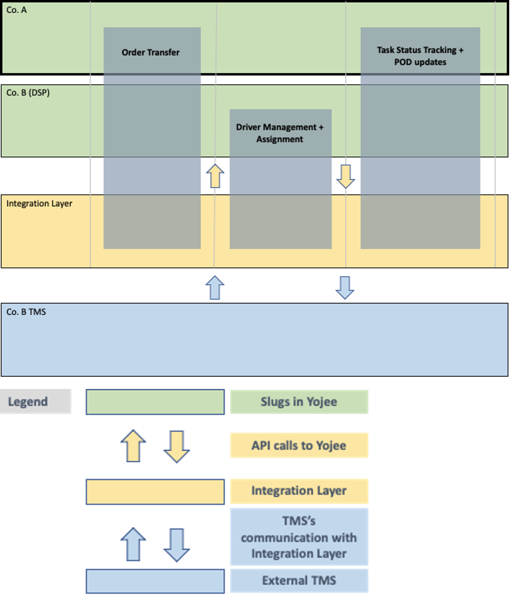

**Downstream Partner Integration Solution Guide**

## Overview

Yojee’s customers use our platform to track their transport orders. In some use cases, they transfer orders to their downstream partners (DSPs for abbreviation) for further order execution. This is achieved through creating a separate instance in Yojee (we refer to this as a ‘slug’) and providing the DSP to access this slug. The DSP will proceed to assign drivers to the transferred orders and their drivers will do status updates. The status updates will be visible in both the DSP and the upstream partner (USP), Yojee customer’s slugs.

In certain cases, the DSPs have their own Transport Management Systems, and would like to integrate with Yojee. To achieve this, there is a need to call specific Yojee APIs.

This document outline the integration flow, and describe the individual API calls needed. 



The solution to integrate Yojee with DSP’s TMS is designed as follows:

- Co. A will continue to use its slug in Yojee for its operations
- A slug will be created for Co. B (DSP) in Yojee. Co. A will continue to transfer orders to Co. B through Co. A’s slug.
- An **Integration Layer** will need to be introduced between Yojee’s backend and DSP’s TMS to be the bridge between both systems. The Integration Layer will communicate with Yojee using a set of standard Yojee APIs to perform the operations. Decision points in the Integration Layer, like whether the transfer order is accepted or declined, will likely be dependent on the information coming from the Co. B’s TMS.

The Integration Solution can also be broken down into the following components.

- Order Transfer
  - to retrieve incoming order details
  - to accept / decline the incoming orders
- Update charges of the order, so it will be visible in US slug
- Get Documents
  - USP might have some documents attached to the order, which are essential to plan / execute the delivery.
- Task Status Tracking + POD updates
  - where the external TMS will mark the various stages of pickup/dropoff task completions, and upload signatures or pictures of the delivery as PODs
  - in some cases the external TMS will send some documents to the upstream


For the API calls, the Integration Layer needs to authenticate using Co. B’s Dispatcher credentials. This is typically done by including the COMPANY_SLUG and the Dispatcher’s ACCESS_TOKEN in the HTTP header.

<!-- theme: info -->

> ### Note
>
> See the section on **Basic Information on APIs - Authentication** at the end of this document for more information on authentication.

### Retrieve incoming order details

Incoming transfer orders will be in Co. B’s slug as orders with **created** status. To retrieve the order information and the order item information for these orders, we will need to make 2 calls:

- Dispatcher Get Orders with status **created**.
- Dispatcher Get Single Order Detail by retrieving the **order_number** from the call above.

### [Dispatcher Get List of Orders](https://yojee.stoplight.io/docs/yojee-downstream-api/publish/api_v4_company_orders.yaml/paths/~1api~1v4~1company~1orders/get)

This API call will retrieve orders matching the criteria provided in the parameters.

For full request/response details, please click on the title.

###### Sample Curl Command

```shell
curl --location -g --request GET '[BASEURL]/api/v4/company/orders?page_size=50&page=1&status[]=created&from=2022-11-14T16:00:00.000Z&to=2022-11-14T16:00:00.000Z' \
--header 'COMPANY_SLUG: [SLUG]' \
--header 'ACCESS_TOKEN: [TOKEN]'
```

### [Dispatcher Get Order](https://yojee.stoplight.io/docs/yojee-downstream-api/publish/api_v4_company_order.yaml/paths/~1api~1v4~1company~1order/get)

This API call will retrieve order information based on either order number or order external id.

For full request/response details, please click on the title.

###### Sample Curl Command

```shell
curl --location -g --request GET '[BASEURL]/api/v4/company/order?number=O-K02IHA1XHHWU' \
--header 'COMPANY_SLUG: [SLUG]' \
--header 'ACCESS_TOKEN: [TOKEN]'
```

### [Accept the transfer order](https://yojee.stoplight.io/docs/yojee-downstream-api/publish/api_v4_company_order_bulk_accept.yaml/paths/~1api~1v4~1company~1order~1bulk_accept/put)

Call this API to **accept** the transfer order from upstream partner.

###### Sample Curl Command

```shell
curl --location --request POST '[BASEURL]/api/v4/company/order/bulk_accept' \
--header 'COMPANY_SLUG: [SLUG]' \
--header 'ACCESS_TOKEN: [TOKEN]' \
--data-raw '{
    "data": [
        
         {
            "order_number": "O-7CKFRWUIXFTU",
            "carrier_references": [{"name": "BookingID", "value": "A123"}]
        }
    ]

}'
```

For full request/response details, please click on the title.


### [Get Reason codes](https://yojee.stoplight.io/docs/yojee-downstream-api/publish/api_v4_company_reason_codes.yamlpaths/api~1v4~1company~1reason_codes/get)

Call this api to get the list of reason codes, that can be used in order cancellation / rejection apis.

###### Sample Curl Command

```shell
curl --location -g --request GET '[BASEURL]/api/v4/company/reason_codes' \
--header 'COMPANY_SLUG: [SLUG]' \
--header 'ACCESS_TOKEN: [TOKEN]'
```

For full request/response details, please click on the title.


### [Decline the transfer order](https://yojee.stoplight.io/docs/yojee-downstream-api/publish/api_v3_dispatcher_partner_transfer_dispatcher_bulk_reject_order.yaml/paths/~1api~1v3~1dispatcher~1partner_transfer~1dispatcher~1bulk_reject_order/post)

Call this API to **reject** the transfer order from upstream partner.

###### Sample Curl Command

```shell
curl --location --request POST '[BASEURL]/api/v3/dispatcher/partner_transfer/dispatcher/bulk_reject_order' \
--header 'COMPANY_SLUG: [SLUG]' \
--header 'ACCESS_TOKEN: [TOKEN]' \
--data-raw '{"order_numbers":["O-JYUTHCO2EVO8","O-AGIO5BYIZKBQ"],"cancelled_notes":"Insuffiecient capacity","reason_code":"INCP"}'
```

For full request/response details, please click on the title.

### [Creating/Updating charges](https://yojee.stoplight.io/docs/yojee-downstream-api/publish/api_v4_company_upsert_charges.yaml/paths/~1api~1v4~1company~1integration~1order~1{number}/charges/put)

Call this API to **create / update** charges linked to an order

For full request/response details, please click on the title.

###### Sample Curl Command

```shell
curl --location --request PUT '[BASEURL]/api/v4/company/integration/order/{number}/charges' \
--header 'COMPANY_SLUG: [SLUG]' \
--header 'ACCESS_TOKEN: [TOKEN]' \
--data-raw '{
  "number": "O-123",
  "charges": [
    {
      "charge_code": "BFC",
      "currency": "AUD",
      "description": "Route Price",
      "sell": 3
    },
    {
      "charge_code": "SURCHARGES",
      "currency": "AUD",
      "description": "Carrier Surcharges",
      "sell": 20
    }
  ]
}'
```

### [Get Rate Charge Types](https://yojee.stoplight.io/docs/yojee-downstream-api/publish/api_v3_dispatcher_get_rate_charge_types.yaml/paths/~1api~1v3~1dispatcher~1rates~1rate_charge_types/get)

Call this API to **get** rate charge types

###### Sample Curl Command

```shell
curl --location --request GET '[BASEURL]/api/v3/dispatcher/rates/rate_charge_types' \
--header 'COMPANY_SLUG: [SLUG]' \
--header 'ACCESS_TOKEN: [TOKEN]' \
```

For full request/response details, please click on the title.

### [Dispatcher Assign Driver to tasks](https://yojee.stoplight.io/docs/yojee-downstream-api/publish/api_v4_company_delivery_execution_assign.yaml/paths/~1api~1v4~1company~1delivery_execution~1assign/post)


Call this API to assign a Driver to tasks.

###### Sample Curl Command

```shell
curl --location --request POST '[BASEURL]/api/v4/company/delivery_execution/assign' \
--header 'COMPANY_SLUG: [SLUG]' \
--header 'ACCESS_TOKEN: [TOKEN]' \
--header 'Content-Type: application/json' \
--data-raw '{
    "data": 
        [
            {"orders": [
                {
                    "number": "O-MXNCVU9PEFC2",
                    "step_sequences": [0]
                }
            ],
            "driver": {
                "assigned_time": "2025-06-19T06:35:12.78"
            }
            }
        ]
    
}'
```

For full request/response details, please click on the title.

###### Sample Response

```json
{
  "data": [
    {
      "data": {
        "selectors": [
          {
            "number": "O-EMEM10XJADI6"
          }
        ]
      },
      "status": "success"
    }
  ]
}
```

## Order completion

Order completion is done by a background job. The first call is to send the parameters to the background job for execution, and the second call is to get the status of the background job to see the outcome.

### [Dispatcher mark the task / order as completed](https://yojee.stoplight.io/docs/yojee-downstream-api/publish/api_v4_company_delivery_execution_complete.yaml/paths/~1api~1v4~1company~1delivery_execution~1complete/post)

###### Sample Curl Command

```shell
curl --location --request POST '[BASEURL]/api/v4/company/delivery_execution/complete' \
--header 'COMPANY_SLUG: [SLUG]' \
--header 'ACCESS_TOKEN: [TOKEN]' \
--header 'Content-Type: application/json' \
--data-raw '{
    "data": [
        {
            "orders": [
                
                 {
                    "number": "O-3LBETYLWASX1",
                    "step_sequence": 0
                }
            ],
            "event_data": {
                "event_type": "complete",
                "event_time": "2024-03-09T14:25:33.55",
                "departure_time": "2024-03-10T13:00:00"
            }
        }
    ]
}'
```

###### Sample Response

```json
{
    "data": {
        "id": "6bbaf969ab3041eeb1e70ddab60a4e90",
        "type": "complete_or_report",
        "inserted_at": "2025-06-19T03:58:05.090793"
    }
}
```

For full request/response details, please click on the title.

#### [Dispatcher check order completion status](https://yojee.stoplight.io/docs/yojee-downstream-api/publish/api_v4_company_delivery_execution_bg_status.yaml/paths/~1api~1v4~1company~1delivery_exection~1bg_status)

Call this api to check if the completion status update is successful.

###### Sample Curl Command

```shell
curl --location --request GET '[BASEURL]/api/v4/company/delivery_execution/bg_status' \
--header 'COMPANY_SLUG: [SLUG]' \
--header 'ACCESS_TOKEN: [TOKEN]' \
--header 'Content-Type: application/json' \
--data-raw '{
    "id": "6bbaf969ab3041eeb1e70ddab60a4e90"
}'
```
#### Sample response

```json
{
    "data": {
        "id": "6bbaf969ab3041eeb1e70ddab60a4e90",
        "total": null,
        "type": "complete_or_report",
        "progress": null,
        "result": [
            {
                "data": {
                    "selectors": [
                        {
                            "number": "O-3LBETYLWASX1",
                            "step_sequence": 0
                        }
                    ]
                },
                "status": "success"
            }
        ],
        "inserted_at": "2025-06-19T03:58:05.090793",
        "updated_at": "2025-06-19T03:58:07.207055",
        "completed_at": "2025-06-19T03:58:07.207055",
        "cancelled_at": null,
        "processed": null,
        "failed_at": null
    }
}
```

For full request/response details, please click on the title.

### [Get documents](https://yojee.stoplight.io/docs/yojee-downstream-api/publish/api@v3@dispatcher@documents.yaml/paths/~1api~1v3~1dispatcher~1documents/get)

Call this api to get the documents attached to the order;

###### Sample Curl Command

```shell
curl --location --request GET '[BASEURL]/api/v3/dispatcher/documents' \
--header 'COMPANY_SLUG: [SLUG]' \
--header 'ACCESS_TOKEN: [TOKEN]' \
--header 'Content-Type: application/json' 
```

For full request/response details, please click on the title.

### Attach documents to the order

1. Upload the document to TCMS and get a pre-signed url
2. Send the presigned url and the order details to attach the document to the order

### [Upload document to TCMS and get presigned url](https://yojee.stoplight.io/docs/yojee-downstream-api/publish/api@v3@dispatcher@documents@presigned_url.yaml/paths/~1api~1v3~1dispatcher~1presigned_url/get)

Call this api to attach documents to the order;

###### Sample Curl Command

```shell
curl --location --request GET '[BASEURL]/api/v3/dispatcher/documents/presigned_url' \
--header 'COMPANY_SLUG: [SLUG]' \
--header 'ACCESS_TOKEN: [TOKEN]' \
--header 'Content-Type: application/json' 
```

For full request/response details, please click on the title.

### [Attach documents to the order](https://yojee.stoplight.io/docs/yojee-downstream-api/publish/api@v3@dispatcher@documents.yaml/paths/~1api~1v3~1dispatcher~1documents/presigned_url/post)

Call this api to attach documents to the order;

### [Get list of document classification codes](https://yojee.stoplight.io/docs/yojee-downstream-api/publish/api_v4_dispatcher_document_classifications.yaml/paths/~1api~1v4~1dispatcher~1document_classifications/get)

###### Sample Curl Command

```shell
curl --location --request POST '[BASEURL]/api/v4/dispatcher/document_classifications' \
--header 'COMPANY_SLUG: [SLUG]' \
--header 'ACCESS_TOKEN: [TOKEN]' \
--header 'Content-Type: application/json' 
```

For full request/response details, please click on the title.

### Authentication

Most of the API calls will require the following parameters in the header:

<table style="text-align: left;">
    <tr>
        <td><strong>Parameter</strong></td>
        <td><strong>Type</strong></td>
    </tr>
    <tr>
        <td>company_slug</td>
        <td>string</td>
    </tr>
    <tr>
        <td>access_token</td>
        <td>string</td>
    </tr>
</table>

##### Company Slug

The Company Slug is a string to uniquely identify each instance of a customer’s company in Yojee. Each customer is assigned a slug which they will use as part of the authentication information.

##### Access Token

A long-lived Access Token is generated for the `Dispatcher` account. This token will only change upon a change in the password of the Dispatcher account.

Obtain this information from the Yojee team working with you.

In this document we will use `[SLUG]` and `[TOKEN]` to represent the `company_slug` and `access_token` respectively.

USP - Upstream Partner <br />
DSP - Downstream Partner <br />
US - Upstream </br>
DS - Downstream <br />
